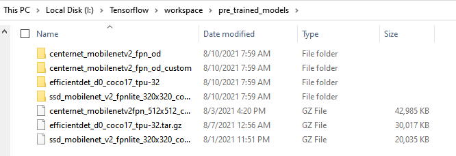

# BirdBox_helping_drone_detect_bird
Detect bird given image 

## Setup
1. Refer to my [bird_box_app repository](https://github.com/khanin-th/bird_box_app) for setting up virtual environment (optional) and required files to run TensorFlow API
1. Set up folder structure (I used structure similar to this [tutorial](https://www.youtube.com/watch?v=yqkISICHH-U) by Nicholas Renotte, which is repeated here in [recommend_folder_structure.txt](recommend_folder_structure.txt))
1. Download pre-trained model from [TensorFlow 2 Detection Model Zoo](https://github.com/tensorflow/models/blob/master/research/object_detection/g3doc/tf2_detection_zoo.md) and extract the model inside `Tensorflow/workspace/pre_trained_models` as shown

1. Create `label_map.pbtxt`, `train.record` and `test.record` as per instructions in [generate_record_file.ipynb](generate_record_file.ipynb)
1. Create a new folder to store files which will be created at re-training steps. Copy model config file, i.e. `Tensorflow/workspace/pre_trained_models/centernet_mobilenetv2_fpn_od/pipeline.config` to the newly created folder, i.e. `Tensorflow/workspace/models/my_centernet_v1`
1. You will need to manually alter certain information in the newly copied config file. The required fields to be able to re-train the `CenterNet MobileNetV2 FPN 512x512` is as follwoing

    <center>
    
    | Parameter  | Value |
    | ------------- | ------------- |
    | model.center_net.num_classes  | 1  |
    | train_config.batch_size  | 4  |
    | train_config.fine_tune_checkpoint  | `Tensorflow\\workspace\\pre_trained_models\\centernet_mobilenetv2_fpn_od\\checkpoint\\ckpt-301`  |
    | train_config.fine_tune_checkpoint_version  | 2  |
    | train_input_reader.label_map_path  | `Tensorflow\\workspace\\TF_files\\label_map.pbtxt`  |
    | train_input_reader.tf_record_input_reader.input_path  | `Tensorflow\\workspace\\TF_files\\train.record`  |
    | eval_input_reader.label_map_path  | `Tensorflow\\workspace\\TF_files\\label_map.pbtxt`  |
    | eval_input_reader.tf_record_input_reader.input_path  | `Tensorflow\\workspace\\TF_files\\test.record` |

    </center>

1. Run the following script in command prompt to start training process 

    ```
    python Tensorflow\models\research\object_detection\model_main_tf2.py --model_dir=Tensorflow\workspace\models\my_centernet_v1 --pipeline_config_path=Tensorflow\workspace\models\my_centernet_v1\pipeline.config --num_train_steps=50000
    ```
    Note that `num_train_steps` can be any nunber as you wish

1. (Optional) you can run `tensorboard` to visualize progress by running the following command in a separate command prompt

    ```
    cd Tensorflow/workspace/models/my_centernet_v1 && tensorboard --logdir="./train" --host localhost --port 8088
    ```

1. Evaluate the model by running the following command in command prompt

    ```
    python Tensorflow\models\research\object_detection\model_main_tf2.py --model_dir=Tensorflow\workspace\models\my_centernet_v1 --pipeline_config_path=Tensorflow\workspace\models\my_centernet_v1\pipeline.config --checkpoint_dir=Tensorflow\workspace\models\my_centernet_v1
    ```

    The value of interest is `Average Recall     (AR) @[ IoU=0.50:0.95 | area=   all | maxDets=  1 ]`, and it is `0.792` based on the image shown below
    

1. Freeze the model to be used for prediction or deployment via following command prompt

    ```
    python Tensorflow\models\research\object_detection\exporter_main_v2.py  --input_type=image_tensor --pipeline_config_path=Tensorflow\workspace\models\my_centernet_v1\pipeline.config --trained_checkpoint_dir=Tensorflow\workspace\models\my_centernet_v1 --output_directory=Tensorflow\workspace\models\my_centernet_v1\export
    ```


1. Use the newly trained model to find bounding box of image of your choice (use the environment which has all the required parameters for tensorflow API) (Do NOT FORGET to clear GPU memory if you use before closing the notebook)

    [predict_bird_box.ipynb](predict_bird_box.ipynb)

    Application is also available: https://github.com/khanin-th/bird_box_app


## Metrics
1. __False Negative__ is important, because being blind to bird when it is present can harm the drone. The process will aim to reduce __False Negative__, and this essentially leads to high __Recall__, which can be used to compare models (higher __Recall__ is better)
1. Processing time and computational capability requirement are also important, since the model is aimed to be used in detect-and-avoid system for drone. 

These metrics can be combined into a single objective function, so that it can be used to pick the best model out of all candidates.

Proposed objective function is as following,
$$ f = \frac{Recall}{Processing\_time\_per\_image} $$
Note that the computation requirement is inheritted in image processing time, since the hardware used to assess this model will be the same specs.


## Training Data:
[NABirds](https://dl.allaboutbirds.org/nabirds) data set provided by the [Cornell Lab of Ornithology](https://www.birds.cornell.edu/home) comes with a bird bounding box information, and we will turn this into the format supported by TensorFlow API

## Selecting base architecture
Light weights pre-trained object detection models are considered. The initlial screening was ranking the models based on Speed (ms) in ascending order. [Source](https://github.com/tensorflow/models/blob/master/research/object_detection/g3doc/tf2_detection_zoo.md)

1. SSD MobileNet v2 320x320
2. CenterNet MobileNetV2 FPN 512x512
3. EfficientDet D0 512x512

(table for objective function value for these models)

   <center>
   
   | Model  | Objective Function Value |
   | ------------- | ------------- |
   | SSD MobileNet v2 320x320  | $`\frac{0.633}{139.650361/35}=0.159`$  |
   | CenterNet MobileNetV2 FPN 512x512  | $\frac{0.792}{70.526061/35}=0.393$  |
   | EfficientDet D0 512x512  |  $\frac{0.630}{}=0.393$ |
   
   </center>

## Fine tuning the selected architecture
Based on the objective function above, the clear winner is `CenterNet MobileNetV2 FPN 512x512`, which will be used to further fine tune.

### Try different `optimizers`
   <center>
   
   | optimizer  | Recall |
   | ------------- | ------------- |
   | Adam  |   |
   | Momentum  |   |
   | RMSProp  |   |
   
   </center>

### Try different `learning rate`

   <center>
   
   | Learning Rate  | Recall |
   | ------------- | ------------- |
   | base ()  |   |
   | 0.0003  |   |
   | 0.0001  |   |
   | 0.0008  |   |
   
   </center>

### Try different `learning rate decay method`

## Current Best Model
It's performance: [centernet_2.pdf](assets\centernet_2.pdf)
## Future Work:
1. Include samples WITHOUT bird for training the model to recognize the cases bird are not present.
2. Have only samples of bird flapping wings which are better representation for those birds drone will encounter in operation.
3. Use the detected area to predict most likely next movement of the bird, i.e. is the bird flying toward drone or flying away from drone.
